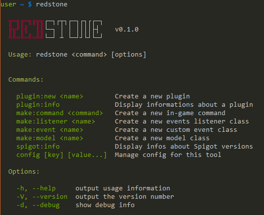

# Redstone - A Spigot plugins manager

[![NPM Version][npm-image]][npm-url]
[![Build Status][travis-image]][travis-url]



This tool can generate the boilerplate code for your next Spigot plugin.

It can also generate code for several things like commands, listeners, custom events, etc.

## Installation

To install this tool you need [Node.js](https://nodejs.org/) version `4.2.3` minimum.

Then you can run:

```shell
$ [sudo] npm install -g spigot-redstone
```

Once installed you wil have access to the `redstone` command.

## Usage

```shell
$ redstone [command] [args]

# Display help:
$ redstone
```

### Create a new plugin

To create a new plugin you have to use the `new` command:

```shell
$ redstone plugin:new MyAwesomePlugin
```

The tool will ask you several questions and will create a directory containing
code ready to be imported in your IDE.

The project generated uses Maven as the dependency manager so you don't have to
add any Spigot or Craftbukkit jar to start coding.

### Generators

Using this tool, you can generate boilerplate code for several things.

#### Generate a command

Don't add `/` to the command, the tool will do it for you.

```shell
$ redstone make:command <command>
```

This will create a class to handle the command and add it to `plugin.yml`.

You will have to add a line in your `onEnable` method to register the command, but the
tool will give you the line to add.

#### Generate an event listener

```shell
$ redstone make:listener <name>
```

If you don't add it, `Listener` will be added at the end of the name (`Example` becomes `ExampleListener`).

#### Generate a custom event

```shell
$ redstone make:event <name>
```

If you don't add it, `Event` will be added at the end of the name (`Example` becomes `ExampleEvent`).

To trigger your custom event, you have to do:

```java
Bukkit.getServer().getPluginManager().callEvent(new ExampleEvent(/* args */));
```

#### Generate a model

```shell
$ redstone make:model <name>
```

### Get informations about your plugin

The tool can show you some infos about your plugin. You juste have to be inside
the plugin's root directory and do:

```shell
$ redstone plugin:info
```

### Spigot versions

You can list Spigot versions (and know which is the last stable) by doing:

```shell
$ redstone spigot:info
```

### Config

You can configure the tool using the tool itself.

```shell
# list all config values
$ redstone config

# show a config value
$ redstone config author.name

# set a config value
$ redstone config author.name John Smith
```

Currently, you can configure `author.name` and `author.website` which are used when you create a new plugin.

## Licence

MIT License

Copyright (c) 2016 Nathan Boiron

Permission is hereby granted, free of charge, to any person obtaining a copy of this software and associated documentation files (the "Software"), to deal in the Software without restriction, including without limitation the rights to use, copy, modify, merge, publish, distribute, sublicense, and/or sell copies of the Software, and to permit persons to whom the Software is furnished to do so, subject to the following conditions:

The above copyright notice and this permission notice shall be included in all copies or substantial portions of the Software.

THE SOFTWARE IS PROVIDED "AS IS", WITHOUT WARRANTY OF ANY KIND, EXPRESS OR IMPLIED, INCLUDING BUT NOT LIMITED TO THE WARRANTIES OF MERCHANTABILITY, FITNESS FOR A PARTICULAR PURPOSE AND NONINFRINGEMENT. IN NO EVENT SHALL THE AUTHORS OR COPYRIGHT HOLDERS BE LIABLE FOR ANY CLAIM, DAMAGES OR OTHER LIABILITY, WHETHER IN AN ACTION OF CONTRACT, TORT OR OTHERWISE, ARISING FROM, OUT OF OR IN CONNECTION WITH THE SOFTWARE OR THE USE OR OTHER DEALINGS IN THE SOFTWARE.

[npm-image]: http://img.shields.io/npm/v/spigot-redstone.svg?style=flat
[npm-url]: https://www.npmjs.org/package/spigot-redstone

[travis-url]: https://travis-ci.org/CraftWorldFr/redstone
[travis-image]: https://img.shields.io/travis/CraftWorldFr/redstone.svg
